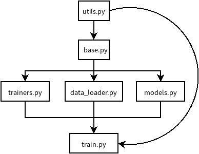

## 源码阅读

|源码|作者|论文|简介|
|----|----|----|----|
|[VAE-LSTM-for-anomaly-detection](https://github.com/lin-shuyu/VAE-LSTM-for-anomaly-detection)| lin-shuyu |[paper](URL)|[链接文本](#VAE-LSTM-for-anomaly-detection)|
|[handson-ml](https://github.com/ageron/handson-ml)|Aurélien Géron|[paper](https://share.weiyun.com/585a9eb697f11ca5f9a168e1785a8bdb)|[链接文本](#handson-ml)|
|||||
|||||
|||||
|||||
|||||
|||||
|||||

### VAE-LSTM-for-anomaly-detection

**使用VAE-LSTM混合模型对时序数据进行异常检测**

在论文中有一处错误：

- 在论文中，假设训练数据N，VAE的一个窗口包含p个数据，那么窗口个数是N-p+1。在论文中表述错误了，但是程序书写没有问题。
- 同上，LSTM的个数N-kp+1,k是指一个LSTM包含k个p长度的VAE窗口数据。

思考总结：

- 我觉得他的程序写的比较有特色的一个地方是使用了`asgparse`库。这是一个命令行解析库。之后使得运行程序的时候不能像平时一样直接在IDE中点击运行，反而要使用命令行的形式：python3 train --config NAB_config.json。主要是因为他设置了一个配置参数，在其配置文件里面保存了模型的超参数。
- 另一个需要学习作者的地方就是图的制作，我也会用matplotlib出图，但是每当我将图插入到文档中其分辨率显得低下，而且字体容易看不清。但作者的图没有这种问题，不知道是采用什么方式避免的。
- 源码分析里`base.py`,`trainer.py`和`models.py`相对比较难。
- 我对tensorflow的编程非常不熟悉，加强学习。注意本文使用tensorflow v1编写的，而现在已经升级到了v2。

### handson-ml

**使用sklearn和tensorflow学习机器学习**

### 